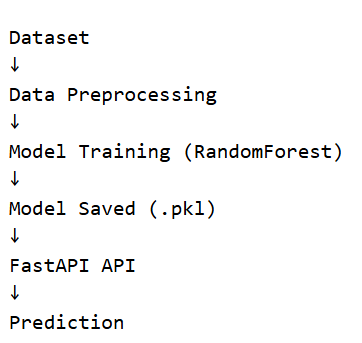
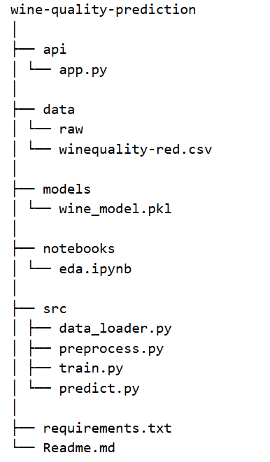

# Wine Quality Prediction ML System

## Project Overview

This project builds an end-to-end machine learning system that predicts whether a wine is good quality or not based on its chemical properties.

The system includes:
- Data preprocessing
- Model training
- Model evaluation
- Model saving
- Prediction API

The trained model is served using a REST API built with FastAPI.

---

## Problem Statement

Given the physicochemical properties of wine such as acidity, pH, alcohol, and sulphates, predict whether the wine is of good quality.

---

## Project Architecture

---

## Tech Stack

Python  
Scikit-learn  
FastAPI  
NumPy  
Pandas  

---

## Project Structure

---

## How to Run the Project

### Install Dependencies
pip install -r requirements.txt

### Train the Model
python src/train.py

### Run the API
uvicorn api.app:app --reload

### Open API Docs
http://127.0.0.1:8000/docs

---

## Example Prediction Input
{
"fixed_acidity": 7.4,
"volatile_acidity": 0.7,
"citric_acid": 0.0,
"residual_sugar": 1.9,
"chlorides": 0.076,
"free_sulfur_dioxide": 11,
"total_sulfur_dioxide": 34,
"density": 0.9978,
"pH": 3.51,
"sulphates": 0.56,
"alcohol": 9.4
}

---

## Future Improvements

- Add model monitoring
- Deploy API to cloud
- Add CI/CD pipeline
- Use deep learning models
